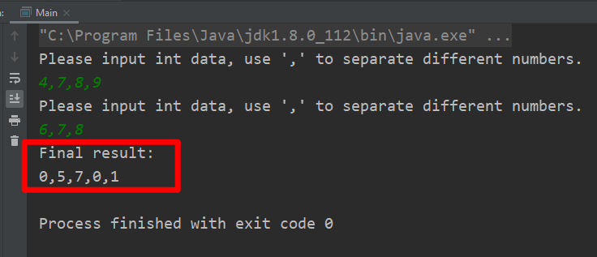

# 两数求和

## 思路

1. 创建BufferedReader从控制台读取两行数据，并对数据正确性进行校验。
2. 读到数据分别存放进两个单向链表firstListNode和secondListNode。
3. 对两个ListNode进行求和操作，最终结果存放入finalListNode。
   - 同时从低位开始遍历两个单向链表
     - 分别获取链表数值并进行求和运算，同时创建一个ListNode结点，把创建好的ListNode和数值存放入finalListNode，直到firstListNode链表遍历完或者secondListNode遍历完。并且，如果两个链表求和的数值大于10，那么需要保留一个进位，值为1，用于下次求和计算。
   - 如果firstListNode链表没有遍历完，那么遍历firstListNode
     - 同时创建一个ListNode结点，把创建好的ListNode和当前firstListNode的数值加上进位值存放入finalListNode，直到firstListNode遍历完。
   - 如果secondListNode链表没有遍历完，那么遍历secondListNode
     - 同时创建一个ListNode结点，把创建好的ListNode和当前secondListNode的数值加上进位值存放入finalListNode，直到secondListNode遍历完。
   - 上面步骤都执行完毕以后再次判断进位值是否为0
     - 如果不为零，还需要创建一个ListNode结点，把创建好的ListNode和当前进位值存放入finalListNode。
   - 返回finalListNode

## 时间复杂度: O(n)

## 难点及易错点

1. 难点：如何对进位值保存并在下一次使用以及清除进位值。
2. 易错点：边界值问题，当firstListNode链表和secondListNode链表长度相等并且最高位加起来大于等于10，那么这个时候还需要把该进位值保存到finalListNode。

## 程序截图

1. 异常输入情况

2.输入正常数据进行测试

### Github地址：[https://github.com/MichaelRap/SumTwoNumbers](https://github.com/MichaelRap/SumTwoNumbers)

## 花费时间：50mins

